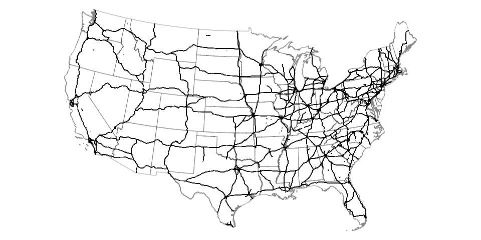

# degauss/pepr_roadways

> DeGAUSS container that calculates distance to nearest roadway and length of roadways within buffer for S1100 and S1200 roadways for PEPR multi-site study

## Primary (S1100) and Secondary (S1200) Roadways

The U.S. Census Bureau defines primary (S1100) roadways as "generally divided, limited-access highways within the Federal interstate highway system or under state management" and "distinguished by the presence of interchanges and are accessible by ramps and may include some toll highways". The map below shows all features defined as "S1100" in the MAF/TIGER database. 



Secondary (S1200) roads are described as "main arteries, usually in the U.S. highway, state highway, or county highway system" and "have one or more lanes of traffic in each direction, may or may not be divided, and usually have at-grade intersections with many other roads and driveways".

This container returns the distance to the nearest primary road and the distance to the nearest secondary road for each geocoded address, as well as the total length of primary roads and the total length of secondary roads within a buffer (defaults to 300 m) around each address. 

## Using

DeGAUSS arguments specific to this container:

- `file_name`: name of a CSV file in the current working directory with columns named `lat` and `lon`

- `buffer_radius`: buffer radius in meters within which to calculate length of roadways; defaults to 300

### Example calls (that will work with example file included in repository):

**MacOS**

```
docker run --rm=TRUE -v "$PWD":/tmp degauss/pepr_roadways:0.2 my_address_file_geocoded.csv
```

**Microsoft Windows**

```
docker run --rm=TRUE -v "%cd%":/tmp degauss/pepr_roadways:0.2 my_address_file_geocoded.csv
```

In the above example call, replace `my_address_file_geocoded.csv` with the name of your geocoded csv file. Optionally, you can add another argument for buffer radius.  Otherwise, the buffer will be 300 meters.

Some progress messages will be printed and when complete, the program will save the output as the same name as the input file name, but with `pepr_roadways` appended, e.g. `my_address_file_geocoded_pepr_roadways.csv`

## DeGAUSS Details

For detailed documentation on DeGAUSS, including general usage and installation, please see the [DeGAUSS](https://github.com/cole-brokamp/DeGAUSS) README.

This software is part of DeGAUSS and uses its same [license](https://github.com/cole-brokamp/DeGAUSS/blob/master/LICENSE.txt).

**Note about data:** 

S1100 roadway shapefiles were downloaded from [tigris](https://github.com/walkerke/tigris). S1200 roadway shapefiles were downloaded directed from the [U.S. Census Bureau](ftp://ftp2.census.gov/geo/tiger/TIGER2018/ROADS/) using the bash script in this repository.

Download the roadway shapefiles needed to build this container:

[S1100](https://s3.amazonaws.com/geomarker.grapph/roads/roads1100_sp_5072.rds)

[S1200](https://s3.amazonaws.com/geomarker.grapph/roads/roads1200_sp_5072.rds)

